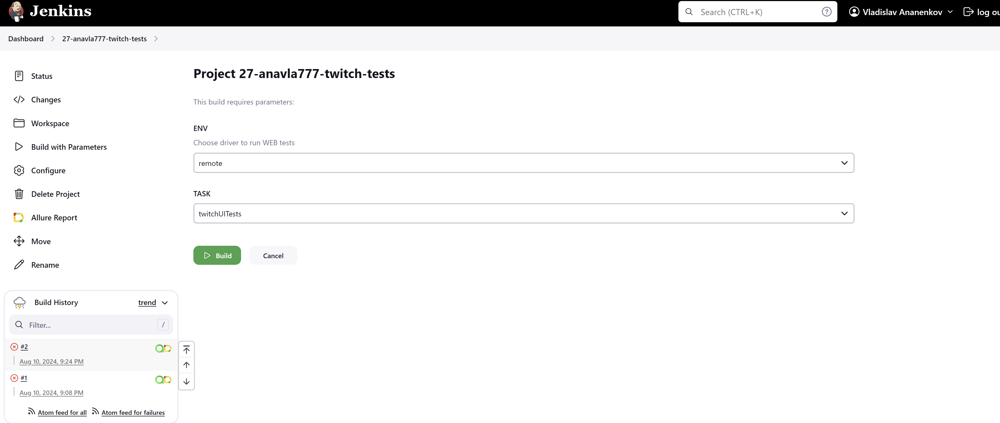
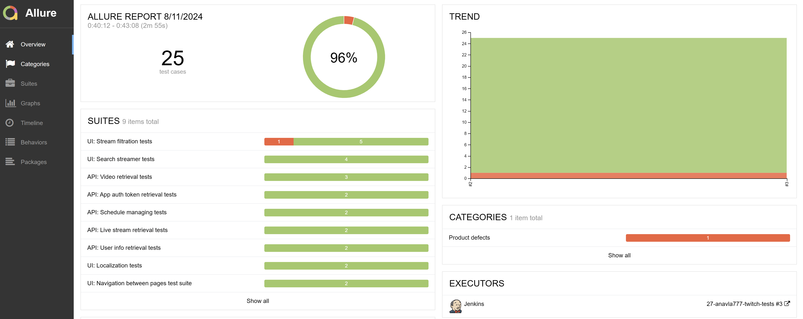
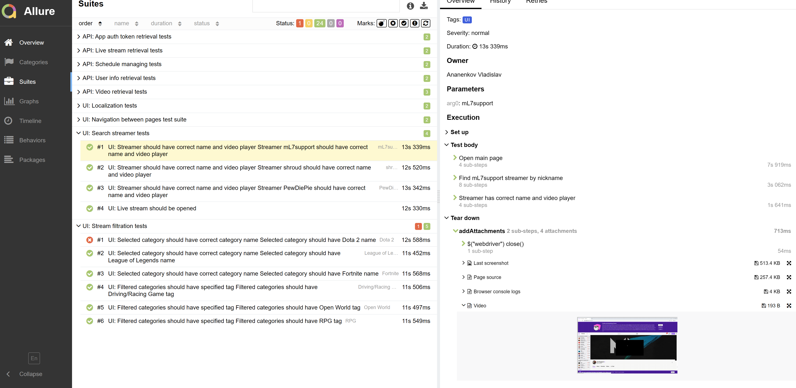
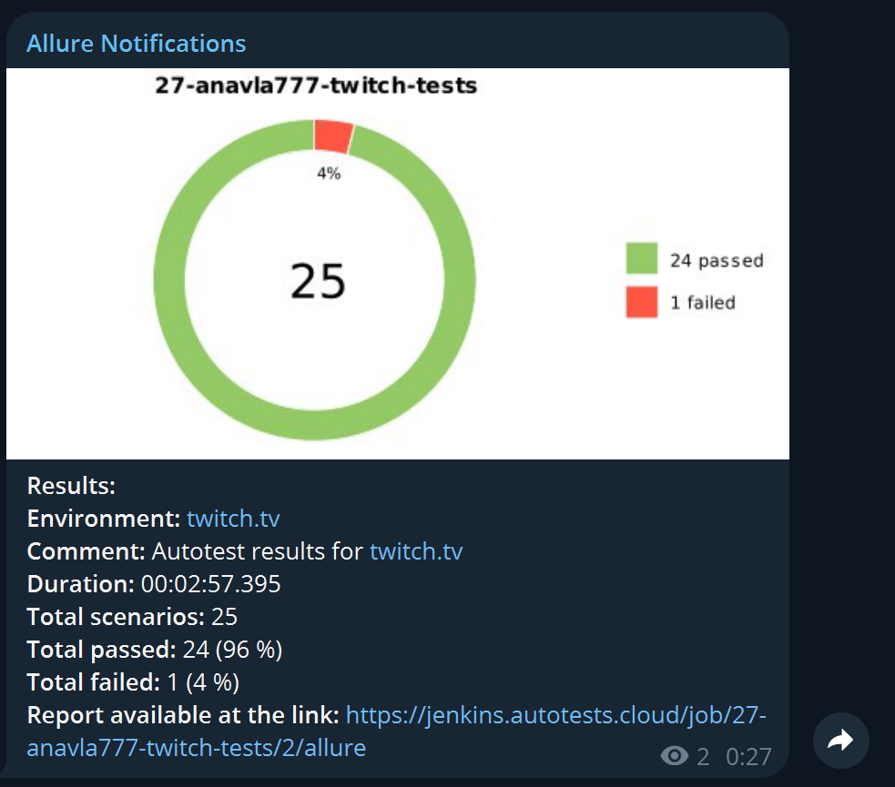

# Automation project for Twitch.tv 
<p align="center"> 
<a href="https://twitch.tv"></a>
</p>

 > Twitch is a video live-streaming service that focuses on video game live streaming,
> including broadcasts of esports competitions, in addition to offering music broadcasts, creative content, and "in real life" streams.
## **Table of contents:**
____

* <a href="#tools">Technology stack</a>
* <a href="#cases">Implemented autotests</a>
* <a href="#jenkins">Build in Jenkins</a>
* <a href="#console">Launch from command line</a>
* <a href="#allure">Allure report</a>
* <a href="#testops">Allure TestOps Integration</a>
* <a href="#jira">Jira Integration</a>
* <a href="#telegram"> Telegram Notifications</a>
* <a href="#video">Examples of test execution in Selenoid</a>
____
## Main project features
- Project contains API and UI tests
- Ability to launch all tests (API + UI) or API and UI separately
- Remote launch via Jenkins with Allure report and Telegram notification
---
<a id="tools"></a>
## <a name="Technonlogy stack">**Technology stack**</a>

<p align="center">  
<a href="https://www.java.com/"></a>
<a href="https://www.jetbrains.com/idea/"></a>   
<a href="https://github.com/"></a>  
<a href="https://junit.org/junit5/"></a>  
<a href="https://gradle.org/"></a>  
<a href="https://selenide.org/"></a>
<a href="https://rest-assured.io/"></a>
<a href="https://aerokube.com/selenoid/"></a>  
<a href="https://github.com/allure-framework/allure2"></a> 
<a href="https://qameta.io/"></a>   
<a href="https://www.jenkins.io/"></a>
<a href="https://www.atlassian.com/software/jira"></a>
<a href="https://telegram.org/"></a>
</p>

- [x] `IntelliJ IDEA` - IDE, used for project development
- [x] `Java` - Project programming language
- [x] `Gradle` - project builder
- [x] `Junit5` - Test framework
- [x] `Selenide` - UI testing framework based on Selenium Webdriver
- [x] `REST-assured` - API testing framework
- [x] `Selenoid` - Tool for remote browser run in Docker container
- [x] `Jenkins` - CI/CD for remote test runs
- [x] `Allure Report` - Test reporting tool
- [x] `Allure TestOps` - Test Management tool
- [x] `Telegram` - Messenger for test report notifications
- [x] `Jira` - Bugtracker system

____
<a id="cases"></a>
## <a name="Implemented tests">**Implemented tests:**</a>
____
### UI
- [x] UI: Parametrized localization test
- [x] UI: Parametrized streamer search test
- [x] UI: Parametrized category filtration
- [x] UI: Parametrized tag check for category
- [x] UI: Live stream opening
- [x] UI: Menu contains Developers option
- [x] UI: Doc Search test

### API
- [x] API: Login with valid credentials
- [x] API: Login with wrong credentials
- [x] API: Create broadcast schedule
- [x] API: Delete broadcast schedule
- [x] API: Get all streams
- [x] API: Get all streams with specified language
- [x] API: Get user info for existing user
- [x] API: Get user info for non-existing user
- [x] API: Get video by specified video id
- [x] API: Get videos for existing user
- [x] API: Get videos for non-existing user

____
<a id="jenkins"></a>
## </a><a name="Building"></a>Building in [Jenkins](https://jenkins.autotests.cloud/job/27-anavla777-twitch-tests/)</a>
____
<p align="center">  
  
</p>


### **Build parameters in Jenkins:**

- *ENV* (remote)
- *TASK (twitchAllTests, twitchUITests, twitchAPITests)*
UI part is configured via remote.properties (created in Jenkins)
API credentials are configured via auth.properties
<a id="console"></a>
## Launch commands

---
<details>
  <summary>Project launch details</summary>
Project allows to run tests locally

Before local start, create the following files:
- remote.properties in src/test/resources/config/ directory (for Selenoid runs).
  In this file you need to specify:
  - baseUrl = *project base URL*
  - browser = *browser in which tests will be performed*
  - browserSize = *browser windows size*
  - browserVersion = *browser version*
  - isRemote = *true*
  - remoteUrl = *selenoid URL*
  - selenoidUser = *selenoid user*
  - selenoidPass = *selenoid password*
- for tests on local browser update local.properties, if needed:

    - baseUrl = *project base URL*
    - browser = *browser in which tests will be performed*
    - browserSize = *browser windows size*
    - browserVersion = *browser version*
    - isRemote = *false*
- auth.properties file in src/test/resources/config/

    In this file specify:
  - client_id = *app token client id*
  - client_secret = *app token client secret*
  - grant_type=client_credentials
  - user_client_id = *user client id*
  - user_token = *user app token*


- launch all tests
```bash
for test runs on remote selenoid:

gradle clean twitchAllTests 
  -Denv=remote
  
for test runs on local browser:

gradle clean twitchAllTests
  -Denv=local
  ```
- launch only UI tests
```bash  
for test runs on remote selenoid:

gradle clean twitchUITests 
  -Denv=remote
  
for test runs on local browser:

gradle clean twitchUITests
  -Denv=local
  ```
- launch only API tests
```bash  
gradle clean twitchAPITests
  ```
- Launch allure reporting server:
```bash 
gradle allureServe
```
***Remote launch via Jenkins:***
```bash  
clean ${TASK}
-Denv=${ENV}
where ENV and TASK can be selected before run
```
Additional settings can be configured via remote.properties file in Jenkins:
```bash 
baseUrl - project base URL
browser - browser in which tets will be performed
browserSize - browser windows size
browserVersion - browser version
isRemote - if true, remote selenoid host wil be used for tests
remoteUrl - selenoid URL
selenoidUser - selenoid user
selenoidPass - selenoid password
```
And auth tokens in auth.properties file in Jenkins: 
```bash 
  client_id = *app token client id*
  client_secret = *app token client secret*
  grant_type=client_credentials
  user_client_id = *user client id*
  user_token = *user app token*
```
</details>

___
<a id="allure"></a>
## </a> <a name="Allure"></a>Allure [report](https://jenkins.autotests.cloud/job/27-anavla777-twitch-tests/allure/)</a>
___

### *Test run graphs*

<p align="center">  
  
</p>  

### *Detailed test run report*

  <p align="center">  

</p>

---
<a id="testops"></a>
## <b><a target="_blank" href="https://allure.autotests.cloud/project/4333">Allure TestOps</a></b> Integration
___
>Test run graphs
>


>Test Cases:
>
 

---
<b><a id="jira" target="_blank" href="https://jira.autotests.cloud/browse/HOMEWORK-1316">Jira</a></b> Integration
---
>Jira task
>


>In `Allure:Test Cases` section test cases are displayed
>


<a id="telegram"></a>
## </a> Telegram Notifications
____
<p align="center">  
  
</p>

____
<a id="video"></a>
## </a> Example of test execution in Selenoid
____
<p align="center">
   
</p>
